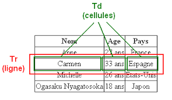
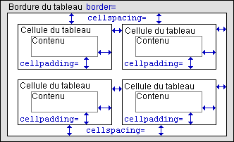
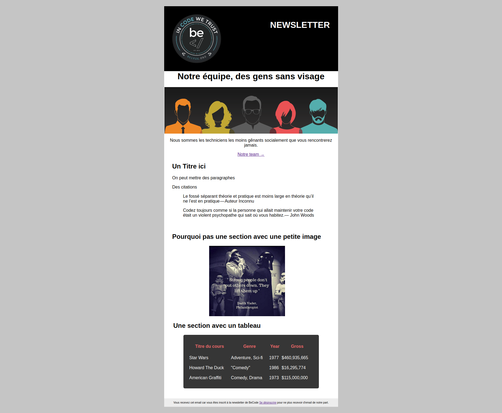

# Newsletter

## Consignes de base
- La largeur : aujourd’hui la taille standard des écrans permet l’affichage de newsletters mesurant 620 pixels de large. Cependant, préférez du 530 pixels.
- La hauteur : pas de limite. N’oubliez pas cependant que les premiers 300 pixels s’affichent dans le panneau de visualisation des logiciels.

Testez impérativement l’affichage de votre message dans les principaux webmails – Gmail, Outlook.com, Yahoo Mail – et logiciels de messagerie (Outlook, Windows Live Mail, Thunderbird). Vous verrez, vous aurez des surprises !

## Le style d'une newsletter
Quand il s’agit d’e-mail en HTML, il vaut mieux utiliser des styles en ligne directement sur les éléments concernés (c'est-à-dire avec l'attribut `style=""`).
`
Coucou toi
`

Oubliez les feuilles de style CSS pour le colonage et utilisez les bons vieux tableaux HTML (<table></table>) si vous voulez que vos messages ressemblent à quelque chose dans des webmails comme Gmail par exemple.

## Les tableaux pour la mise en page
Pour les emails, les tableaux c'est bien. Et puis en fait il n'y a pas vraiment le choix.

### Qu'est_ce qu'un tableau ?
Un tableau est un ensemble structuré de données (table de données) présentées en lignes et colonnes. Un tableau vous permet de retrouver rapidement et facilement des valeurs au croisement entre différents types de données, par exemple : une personne et son âge, ou un jour et la semaine, ou les horaires d'ouverture de la piscine du quartier.

Fais quelques recherches sur les termes `table, td, tr, thead, th, colgroup.`

## Les images d'une newsletter
Dans votre code HTML, toutes les images doivent être hébergées sur un serveur public, et tous les liens doivent être définis comme chemins absolus qui pointent directement vers ce serveur public. Vous pouvez également utiliser le gestionnaire de contenu de votre compte Mailchimp pour héberger vos images et insérer des URL d'image dans votre code HTML.
Vous utiliserez donc les adresses absolues (exemple : http://www.bidule.fr/img/img1.gif) pour les afficher dans le code source de votre courriel.

## Exercice
Toutes les images dont vous avez besoin se trouvent dans ce repository dans le dossier images
Vous allez créer une newsletter en vous inspirant de ce template :

- Nom du repo sur GitHub : `newsletter-tableau`.
- Inscrivez vous  sur [sarbacane](https://sarbacane.app/#!/p/home) ou sur [mailchimp](https://mailchimp.com/) et envoyez le par mail à l'un de vos coach.

